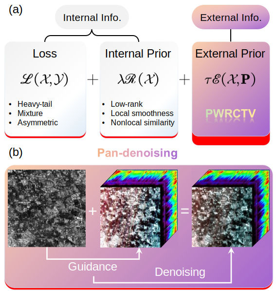

# Pan-denoising by PWRCTV
This repository contains the MATLAB code for the paper "Pan-denoising: Guided Hyperspectral Image Denoising via Weighted Represent Coefficient Total Variation". The code implements the proposed PWRCTV method for hyperspectral image denoising using panchromatic image guidance.

## Pan-denoising

## Contents
* `main.m`: The main function for running the denoising experiment.
* `PWRCTV.m`: The implementation of the PWRCTV denoising algorithm.
* `data_generator.m`: Functions for generating synthetic noisy hyperspectral images.
* `evaluate.m`: Functions for evaluating the denoising performance using various metrics.
* `datasets/`: Folder containing the synthetic and real-world datasets used in the experiments.
  
## Usage
1. **Setup**: Download the code and datasets from the repository.
2. **Run the main function**: Execute `main.m` to run the denoising experiment on the synthetic and real-world datasets. You can modify the parameters in the main function to suit your needs.
3. **Visualize results**: The denoised images and corresponding metrics will be saved in the `results/` folder.

## Dependencies
* MATLAB

